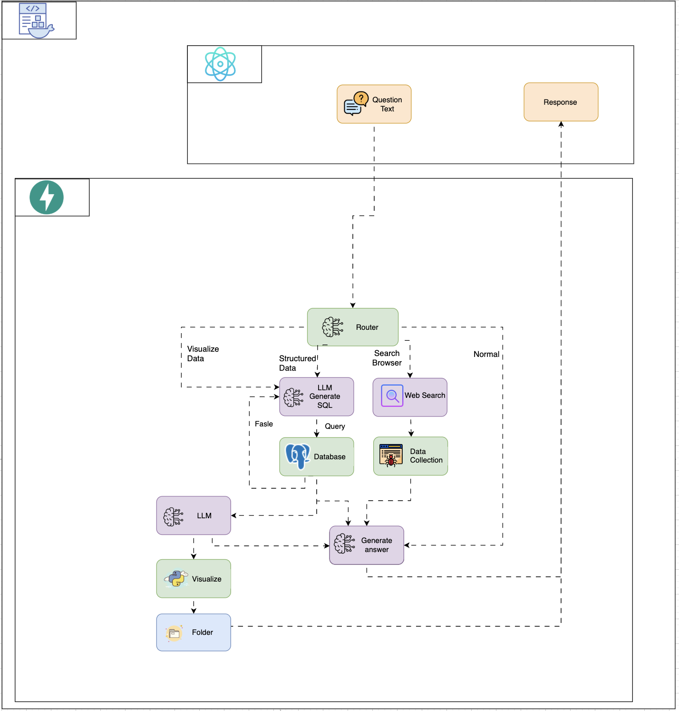

# Financi-Agent: Multi-Agent Finance System


## 🚀 Giới thiệu

**Financi-Agent** là hệ thống multi-agent AI chuyên về tài chính, sử dụng mô hình ngôn ngữ lớn (LLM) OpenAI GPT-4o-mini để tự động hóa việc trả lời câu hỏi, truy vấn dữ liệu, tìm kiếm thông tin tài chính trên web và trực quan hóa dữ liệu. Hệ thống này phù hợp cho các ứng dụng chatbot, trợ lý tài chính, phân tích dữ liệu và dashboard tài chính.

---

## 🖥️ Giao diện người dùng

- **Trang chủ**:  
  

---

## 🛠️ Pipeline tổng quan hệ thống

- Người dùng nhập câu hỏi tài chính.
- **Router Agent** xác định loại câu hỏi:
  - Nếu là truy vấn dữ liệu: chuyển cho **Database Query Agent**.
  - Nếu là tìm kiếm web: chuyển cho **Google Search Agent**.
  - Nếu là yêu cầu trực quan hóa: chuyển cho **Visualize Agent**.
  - Nếu là hội thoại thông thường: chuyển cho **Conversation Agent**.
- Kết quả được tổng hợp, sinh phản hồi và trả về giao diện người dùng.

Xem chi tiết pipeline tại hình sau:  


---

## 📁 Cấu trúc thư mục

```text
.
├── backend
│   ├── api.py
│   ├── data/
│   ├── main.py
│   ├── src/
│   │   ├── agent/
│   │   │   ├── conversation.py      # Agent hội thoại
│   │   │   ├── database_query.py    # Agent truy vấn dữ liệu
│   │   │   ├── google_search.py     # Agent tìm kiếm web
│   │   │   ├── visualize_agent.py   # Agent trực quan hóa
│   │   │   └── ...
│   │   ├── router/
│   │   └── utils/
│   └── requirements.txt
├── frontend
│   ├── src/
│   │   ├── components/
│   │   └── ...
│   ├── package.json
│   └── ...
├── images/
│   ├── image.png
│   ├── image copy.png
│   └── image copy 2.png
├── visualizations/
│   └── ...
└── README.md
```

---

## 🤖 Các Agent chính

### 1. **Conversation Agent** (`conversation.py`)  
[🔗 Xem mã nguồn](./backend/src/agent/conversation.py)

- **Chức năng:**
  - Xử lý hội thoại tự nhiên với người dùng.
  - Trả lời các câu hỏi chung về tài chính, chào hỏi, hướng dẫn sử dụng, hoặc các câu hỏi không thuộc các nhóm chuyên biệt khác.
  - Đảm bảo phản hồi luôn bằng tiếng Việt, lịch sự, chuyên nghiệp, thân thiện.
- **Cách hoạt động:**
  - Khi nhận được tin nhắn, agent kiểm tra xem đó có phải là lời chào hay yêu cầu trợ giúp không (ví dụ: "xin chào", "bạn là ai", "giúp tôi", ...).
  - Nếu đúng, trả về phản hồi chuẩn (ví dụ: chào buổi sáng/chiều/tối, giới thiệu chức năng...).
  - Nếu không, sử dụng mô hình LLM (OpenAI GPT-4o-mini) để sinh phản hồi dựa trên prompt đã thiết kế, có thể sử dụng thêm thông tin ngữ cảnh người dùng nếu có.
  - Hỗ trợ cả xử lý đồng bộ và bất đồng bộ, có cơ chế retry khi gặp lỗi.
- **Ví dụ sử dụng:**
  - Người dùng hỏi: "Bạn có thể làm gì?" → Agent trả lời các chức năng chính.
  - Người dùng chào: "Chào buổi sáng" → Agent trả lời chào lại và giới thiệu.

### 2. **Database Query Agent** (`database_query.py`)  
[🔗 Xem mã nguồn](./backend/src/agent/database_query.py)

- **Chức năng:**
  - Tự động chuyển đổi câu hỏi tự nhiên của người dùng thành câu truy vấn SQL phù hợp với cơ sở dữ liệu tài chính (PostgreSQL).
  - Thực thi truy vấn, trả về kết quả dạng bảng (columns, rows).
  - Hỗ trợ retry khi truy vấn lỗi.
- **Cách hoạt động:**
  - Nhận câu hỏi từ người dùng (ví dụ: "Giá đóng cửa của Microsoft ngày 15/3/2024 là bao nhiêu?").
  - Sử dụng LLM để sinh câu truy vấn SQL dựa trên schema của database (schema này được lấy từ file cấu hình hoặc hàm).
  - Thực thi truy vấn SQL trên PostgreSQL, trả về kết quả (danh sách cột, dữ liệu).
  - Có thể chạy đồng bộ hoặc bất đồng bộ, retry tối đa 3 lần nếu gặp lỗi.
- **Ví dụ sử dụng:**
  - Người dùng hỏi: "Số lượng công ty thuộc từng sector trong DJIA?" → Agent sinh SQL group by sector, trả về bảng kết quả.

### 3. **Google Search Agent** (`google_search.py`)  
[🔗 Xem mã nguồn](./backend/src/agent/google_search.py)

- **Chức năng:**
  - Tìm kiếm thông tin tài chính, tin tức, giá cổ phiếu mới nhất trên web.
  - Sử dụng API Tavily để thực hiện tìm kiếm nâng cao.
  - Trả về kết quả đã được lọc, tóm tắt, kèm link nguồn.
- **Cách hoạt động:**
  - Nhận truy vấn tìm kiếm từ người dùng (ví dụ: "Tin tức mới nhất về Tesla", "Giá cổ phiếu AAPL hiện tại").
  - Gửi truy vấn tới Tavily API, lấy về danh sách kết quả (title, content, url).
  - Lọc, đơn giản hóa kết quả, trả về cho người dùng.
  - Có các hàm tiện ích như: lấy giá cổ phiếu mới nhất, lấy tin tức công ty, lấy xu hướng thị trường.
  - Hỗ trợ retry khi gặp lỗi.
- **Ví dụ sử dụng:**
  - Người dùng hỏi: "Giá cổ phiếu MSFT hiện tại là bao nhiêu?" → Agent tìm kiếm trên web, trả về giá mới nhất và nguồn.

### 4. **Visualize Agent** (`visualize_agent.py`)  
[🔗 Xem mã nguồn](./backend/src/agent/visualize_agent.py)

- **Chức năng:**
  - Phân tích dữ liệu truy vấn được từ database, đề xuất loại biểu đồ phù hợp (bar, line, pie, scatter, boxplot, histogram...).
  - Sinh biểu đồ đẹp, lưu file, trả về link hoặc base64 để hiển thị trên web.
  - Hỗ trợ các trường hợp đặc biệt như boxplot cho giá đóng cửa hàng tháng, histogram cho daily return...
- **Cách hoạt động:**
  - Nhận câu hỏi từ người dùng (ví dụ: "Vẽ biểu đồ pie số lượng công ty theo sector", "Boxplot giá đóng cửa hàng tháng của DIS năm 2024").
  - Gọi Database Query Agent để lấy dữ liệu.
  - Phân tích dữ liệu, sử dụng LLM để đề xuất loại biểu đồ phù hợp (hoặc lấy loại biểu đồ do người dùng chỉ định).
  - Tiền xử lý dữ liệu (xử lý null, chuyển đổi kiểu số, gộp nhóm...).
  - Sinh biểu đồ bằng matplotlib/seaborn, lưu file vào thư mục `visualizations/`, trả về đường dẫn hoặc base64.
  - Có thể xử lý đồng bộ hoặc bất đồng bộ, retry khi gặp lỗi.
- **Ví dụ sử dụng:**
  - Người dùng hỏi: "Pie chart số lượng công ty theo sector" → Agent trả về biểu đồ pie, lưu file, trả về link hình ảnh.
  - Người dùng hỏi: "Boxplot giá đóng cửa hàng tháng của DIS năm 2024" → Agent truy vấn, xử lý dữ liệu, vẽ boxplot, trả về hình ảnh.

## 🧭 Router Agent

- **Chức năng:**
  - Đóng vai trò là bộ định tuyến trung tâm của hệ thống multi-agent.
  - Phân tích câu hỏi đầu vào từ người dùng và xác định loại tác vụ phù hợp.
  - Chuyển tiếp câu hỏi đến đúng agent chuyên biệt: hội thoại, truy vấn dữ liệu, tìm kiếm web, hoặc trực quan hóa.

- **Cách hoạt động:**
  - Khi người dùng gửi câu hỏi, Router Agent sẽ kiểm tra nội dung câu hỏi để xác định:
    - Nếu là chào hỏi, hỏi về chức năng, hoặc hội thoại chung → chuyển đến **Conversation Agent**.
    - Nếu là câu hỏi về dữ liệu, số liệu, lịch sử, giá cổ phiếu... → chuyển đến **Database Query Agent**.
    - Nếu là yêu cầu tìm kiếm tin tức, thông tin mới nhất trên web → chuyển đến **Google Search Agent**.
    - Nếu là yêu cầu trực quan hóa dữ liệu, vẽ biểu đồ → chuyển đến **Visualize Agent**.
  - Đảm bảo mỗi câu hỏi được xử lý bởi agent phù hợp nhất, giúp tối ưu hiệu quả và trải nghiệm người dùng.

- **Ý nghĩa:**
  - Router Agent là "bộ não" điều phối, giúp hệ thống hoạt động linh hoạt, tự động và thông minh.

---

## 🔄 **Tóm tắt luồng hoạt động tổng thể**

1. Người dùng nhập câu hỏi trên giao diện web.
2. Hệ thống backend nhận câu hỏi, router xác định loại tác vụ:
   - Nếu là hội thoại/chào hỏi → Conversation Agent.
   - Nếu là truy vấn dữ liệu → Database Query Agent.
   - Nếu là tìm kiếm web → Google Search Agent.
   - Nếu là yêu cầu trực quan hóa → Visualize Agent.
3. Agent xử lý, trả về kết quả (text, bảng, hình ảnh).
4. Frontend hiển thị kết quả cho người dùng.

---

## 🧠 Mô hình sử dụng

- **OpenAI GPT-4o-mini**: Dùng cho tất cả các agent để sinh ngôn ngữ tự nhiên, sinh truy vấn SQL, phân tích dữ liệu và đề xuất trực quan hóa.

---

## ⚡ Hướng dẫn cài đặt & chạy thử

### 1. **Backend**
```bash
cd backend
python3 -m venv venv
source venv/bin/activate
pip install -r requirements.txt
# Cấu hình .env với OPENAI_API_KEY, TAVILY_API_KEY, thông tin DB
python main.py
```

### 2. **Frontend**
```bash
cd frontend
npm install
npm start
```
- Truy cập: [http://localhost:3000](http://localhost:3000)


## 📄 License

MIT License

---

## 💡 Đóng góp

- Pull request, issue, góp ý đều được chào đón!
- Vui lòng đọc kỹ code trong từng agent để mở rộng hoặc tích hợp thêm nguồn dữ liệu/mô hình mới.

---

## 📞 Liên hệ

- [Your Name/Team]
- [Email/LinkedIn/GitHub]

---

**Financi-Agent** – Trợ lý AI tài chính đa năng, thông minh, dễ mở rộng!

---

Nếu bạn cần bổ sung chi tiết về cài đặt, cấu hình môi trường, hoặc hướng dẫn sử dụng API, hãy cho tôi biết nhé! 